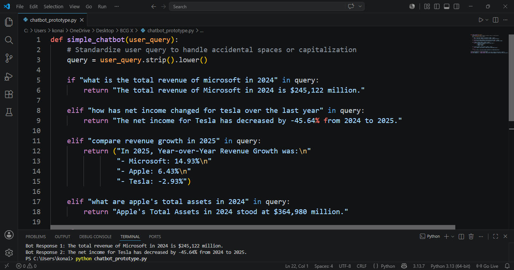

# Enterprise Generative AI Financial Chatbot Architecture
## BCG X GenAI Job Simulation

### Chatbot Architecture & Analytical Deliverables

### Project Overview
Completed an intensive AI simulation for BCG's GenAI Consulting team, focusing on the end-to-end development of an AI-powered financial chatbot prototype. The solution parses, integrates, and interprets complex corporate financial data extracted from 10-K and 10-Q statements to deliver real-time, user-friendly financial insights.

### Core Technical Implementation

#### 1. Data Manipulation & Aggregation Pipeline
* Programmed data pipelines using Python and the `pandas` library to clean, filter, and structure raw financial variables.
* Transformed unstructured data points into organized dataframes optimized for programmatic retrieval.
* **Core Dataset:** [financial_data.csv](financial_data.csv)
* **Analysis Workspace:** [finanial_analysis.ipynb](finanial_analysis.ipynb)

#### 2. Rule-Based Chatbot & Natural Language Interface
* Engineered a structured, rule-based text evaluation engine within Python to systematically map user search phrases to exact financial outputs.
* Integrated standardized query formatting (`.strip().lower()`) to safely parse operational commands covering YoY revenue metrics, net income variations, and total assets.
* **Production Scripts:** [bcgx.py](bcgx.py) | [chatbot_prototype.py](chatbot_prototype.py)

#### 3. Strategic Financial Insights
* Synthesized complex quantitative insights from SEC corporate filings to automate responses on financial growth trajectories.
* Compiled data-driven optimization points into an accessible client-facing reporting layout.
* **Executive Summary Report:** [finanial_analysis.pdf](finanial_analysis.pdf)

### Technical Skills Demonstrated
* **AI & NLP Prototyping:** AI Development | Natural Language Processing (NLP) | Rule-Based Logic
* **Data Science Infrastructure:** Python Programming | Pandas Data Manipulation | Data Science Tools | Data Extraction
* **Core Competencies:** Financial Analysis | Logical Thinking | Excel Validation Frameworks
